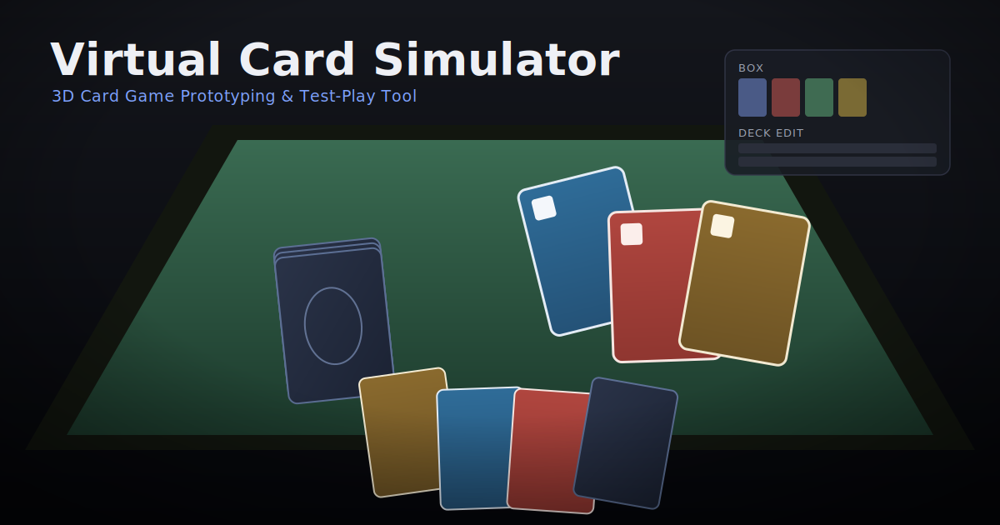

# Virtual Card Simulator

オリジナルカードゲームの制作者向けに、カード画像の登録・デッキ編集・3Dテーブルでのテストプレイをブラウザだけで行えるツールです。

## コンセプト

「Tabletop Simulatorの自由な操作感を、カードゲーム制作とテストプレイに特化して簡略化したブラウザツール」

本アプリは以下の独立した画面で構成されています。BOXと3Dテーブルは同じ画面には表示しません。

1. **メインメニュー** - 各画面への入口
2. **BOX** - カード画像の原本を管理する専用画面
3. **デッキ編集** - BOXのカードからテスト用デッキを組む専用画面
4. **3Dテストプレイ** - 作成したデッキを3Dテーブル上で操作する専用画面

このアプリはカードゲームの**ルールを一切処理しません**。ターン管理・フェーズ管理・コスト計算・ダメージ計算・勝敗判定などはすべてユーザー自身が行う前提です。アプリが管理するのは「カード画像」「デッキデータ」「3Dテーブル上のカードの状態（山札・手札・場・墓地・除外・束）」だけです。第4段階として、**2人用のミニマルなオンライン対戦モード**を追加しました（詳細は後述の「オンライン対戦モード」を参照）。1人用のオフライン機能はすべてそのまま利用できます。

## 現在実装されている機能

- カード画像の自動読み込み（PNG / JPEG）とBOXでの一覧・検索・拡大プレビュー・名称編集
- デッキの新規作成・保存・複製・削除・名称変更、同名カードの無制限追加、複数選択による一括追加
- 3Dテーブル上でのカード選択・ドラッグ移動・表裏切替・90度回転
- 山札（メインデッキ）・墓地・除外・カスタム束が同時に共存できる「束（スタック）」データ構造
- 山札の中身を2D一覧で確認・検索・ドラッグ並び替え・各ゾーンへの移動
- シャッフル、1枚ドロー、任意枚数ドロー（クイックボタンつき）、一番上をめくる
- 墓地・除外エリア（カードを送る・中身を見る・手札やフィールド、山札へ戻す）
- Shiftクリックによる複数選択と、選択カードの一括移動・表裏・回転・ゾーン移動
- 選択カードから明示的に束を作成し、シャッフル・ドロー・中身確認・解除ができる
- 3D空間内の手札エリア（自動整列）、手札⇔フィールドの移動
- テーブルリセット（確認ダイアログ付き、全カード回収＋シャッフル）
- 盤面（カードの配置・山札・手札・墓地・除外・束・テーマ・カメラ位置）の名前付き保存/読み込み/名前変更/削除
- カメラのズーム・回転・初期位置リセット（カード操作との競合防止つき）
- 大型化したカード拡大プレビューと、折りたたみ可能な操作方法パネル
- 3種類のテーブルテーマ（切替は即時反映、`localStorage`に保存され再読み込み後も維持）
- **オンライン対戦モード（2人用・第4段階で追加）** : ルーム作成・招待URLでの参加、カード移動/表裏/回転/ゾーン移動/シャッフル/ドロー/束操作/テーマ変更/テーブルリセットの同期、手札の非公開（相手には枚数と裏面のみ表示）、再接続時の自動復帰と手札復元。詳細は下記「オンライン対戦モード」を参照。

## 起動方法

### オフライン（1人用）のみで使う場合

```bash
npm install
npm run dev
```

表示されたローカルURL（例: `http://localhost:5173`）をブラウザで開いてください。オンライン対戦モードのボタンは表示されますが、オンライン用サーバーを起動していない場合はルーム作成・参加時に接続エラーになります。

### オンライン対戦モードも使う場合

オンライン対戦にはクライアント（Vite）とは別に、ローカルのオンライン用サーバー（Socket.IO）を起動する必要があります。

```bash
npm install
npm run dev:online
```

`dev:online` はクライアント（`http://localhost:5173`）とオンラインサーバー（`http://localhost:3001`）を同時に起動します。個別に起動したい場合は次のコマンドも使えます。

- `npm run dev:client` : クライアント（Vite）のみ起動
- `npm run dev:server` : オンライン用サーバー（`tsx watch server/index.ts`）のみ起動、既定ポートは `3001`（環境変数 `PORT` で変更可）
- `npm run build` : クライアントの型チェック(`tsc -b`) + 本番ビルド + サーバーの型チェック(`typecheck:server`)
- `npm run typecheck:server` : サーバー側だけの型チェック（`tsc -p server/tsconfig.json`、実行ファイルは出力しません）
- `npm run lint` : `oxlint`（`server/`・`shared/`も対象）
- `npm run preview` : クライアントのビルド結果のプレビュー

オンライン用サーバーはヘルスチェック用に `GET /health` を提供します（`{"ok":true,"rooms":<現在のルーム数>}` を返します）。

## 使用技術

- TypeScript / Vite / React / React Router
- Three.js / React Three Fiber / @react-three/drei
- Zustand（状態管理）
- ブラウザ標準の `localStorage`（永続化。IndexedDBは未使用）
- **オンライン対戦モード**: Node.js + TypeScript製の最小構成サーバー（`node:http` + `socket.io`）、クライアント側は`socket.io-client`。ルーム状態はすべてサーバーのメモリ上（`Map`）のみで管理し、データベースは使用していません。
- 外部データベース・外部ストレージ・外部認証・外部AIサービス・外部SaaS（Firebase/Supabase/Pusher/Ablyなど）は一切使用していません

## 有料サービスについて

本プロジェクトは、有料API・有料クラウド・有料データベース・有料ストレージ・有料認証・有料素材のいずれも使用していません。オンライン対戦モードを含め、すべてローカル環境と無料のオープンソースライブラリ（Socket.IOなど）、ブラウザ標準機能のみで動作します。外部のSaaS/BaaS（Firebase、Supabase、Pusher、Ablyなど）は無料枠であっても使用していません。

## BOXの使い方

`/box` 画面はカード原本ライブラリです（3Dテーブルは表示されません）。

1. カード名で検索できます。
2. カードをクリックすると選択され、右側に拡大プレビューが表示されます。
3. プレビュー下の入力欄でカード名を編集し、フォーカスを外すと保存されます（`localStorage`）。
4. リロードしても変更したカード名は保持されます。
5. 画像そのものの削除や、所持枚数の在庫管理は行いません（BOXは「使えるカードの一覧」です）。

## デッキ編集の使い方

`/decks` 画面で行います（3Dテーブルは表示されません）。画面は左（BOXのカード一覧）と右（編集中のデッキ）に分かれています。

1. 「新規デッキ」でデッキを作成、または上部のドロップダウンから既存デッキを選択して編集します。
2. 左側のBOX一覧から「追加」を押すと、そのカードを1枚デッキに追加できます。
3. 右側でデッキ名の変更、各カードの `+` / `-`（1枚単位の増減）、「外す」（そのカードをデッキから完全に削除）ができます。
4. 「保存」を押すまでデッキ名・枚数の変更は確定しません（`localStorage`に保存）。
5. 「複製」「削除」は選択中のデッキに対して行われます。
6. デッキ枚数に上限・下限はありません（1枚デッキ・100枚超デッキも保存可能）。

### 一括選択の使い方

- 左側のカード一覧では、チェックボックスまたはカード本体のクリックで複数カードを選択できます。選択中のカードは枠で強調されます。
- 「表示中をすべて選択」は、現在の検索結果として表示されているカードだけを対象にします。
- 「選択解除」で選択状態をクリアできます。
- 「枚数」欄で1以上の整数を指定し、「選択カードを一括追加」を押すと、選択した全カードがその枚数ずつデッキへ追加されます（デッキに同じカードが既にある場合は加算されます）。
- 一括追加後、選択状態は自動的に解除されます。選択状態自体はUI上だけの一時的なもので、デッキデータには保存されません。

## テストプレイの始め方

デッキ編集画面で編集中のデッキの「テストプレイ」ボタンを押すと `/play/:deckId` に遷移します。デッキに含まれる全カードが、裏向きの山札（メインデッキ）として3Dテーブル上に生成されます（1枚ずつ独立した`CardInstance`）。

## カードの操作方法

- **左クリック**: カードを選択（黄色い枠で強調 + 画面右側に拡大プレビュー表示）
- **Shift + 左クリック**: 選択中のカードを維持したまま追加/解除（複数選択）。すでに選択中のカードをShift+クリックすると選択から外れます。
- **Escキー / 何もない場所を左クリック**: 選択をすべて解除します。
- **左ドラッグ**: カード（テーブル上・手札のどちらも）を掴んで移動。複数選択中は選択カード全体の相対位置を保ったまま一括移動します。ドラッグ中は少し浮き上がり、テーブル範囲外には出せません。
- **右クリック（通常カード）**: カードメニューを表示（表向き/裏向き切替、左右90度回転、手札へ戻す、山札の上/下へ戻す、墓地へ送る、除外する、テーブルから取り除く）。
- **右クリック（複数選択中）**: 一括操作メニューを表示（表向き/裏向き、回転、手札へ戻す、墓地へ送る、除外する、束にする、選択解除）。
- **右クリック（山札・墓地・除外・束）**: それぞれ専用メニューを表示します。
- **マウスホイール**: ズーム（最小・最大距離あり）
- **右ドラッグ / 中ボタンドラッグ**: カメラ視点の回転（左クリックはカード操作専用のため、カメラ操作とは競合しません）
- **画面上部の「カメラ初期位置へ戻す」**: 初期視点に戻します。

カードのドラッグ中・各種右クリックメニュー表示中はカメラ操作が自動的に無効化されます。左側の「操作方法」パネルは折りたたみ可能で、初期状態では開いています。

## 山札の操作方法

山札（メインデッキ）を右クリックすると、専用メニューが表示されます。

- **シャッフル** : 山札の順序をランダムに並び替えます（Fisher-Yates法）。
- **1枚ドロー** : 山札の一番上のカードを取り、手札に加えます（表向きになります）。
- **複数枚ドロー** : 枚数を指定するダイアログを表示します（下記）。
- **一番上のカードをめくる** : 山札の一番上のカードを表向きのままテーブル上（山札の隣）へ置きます。手札には加わりません。ドローとは別の操作です。
- **中身を見る** : 山札一覧パネルを開きます（下記）。
- **山札を移動** : 選択後、テーブル上の好きな場所をクリックすると山札全体がその位置へ移動します。

山札が空の場合、「1枚ドロー」「複数枚ドロー」「一番上のカードをめくる」は無効表示になります。

### 山札の中身を見る方法

山札を右クリック →「中身を見る」で、2D一覧パネルが開きます（3D空間には展開されません）。

- 一覧は**上に表示されているカードほど山札の上**にあることを示しています（パネル内にもその旨のヒントを表示）。
- 各行にカード画像・カード名・「上から◯番目 / 全◯枚」という現在位置を表示します。
- 「一番上へ」「一番下へ」ボタンで、その場でカードを山札の一番上/一番下へ移動できます。
- 行をドラッグ＆ドロップすると、その位置に並び替えられます（即座に山札データへ反映され、パネルを閉じても順番は維持されます）。同名カードが複数あってもinstanceIdで区別して正しく並び替えられます。
- 各行の「操作」から、そのカードを「手札へ加える」「フィールドへ表向き/裏向きで出す」「墓地へ送る」「除外する」「山札の一番上/一番下へ移動」できます。移動したカードは一覧から正しく取り除かれます。
- この一覧UIは墓地・除外・カスタム束の「中身を見る」でも共通して使われます。

### 山札内検索

一覧上部の検索欄にカード名を入力すると、部分一致・大文字小文字を区別せずに即時絞り込まれます。検索結果が0件でもエラーにはなりません。検索中は元の山札順を保持しており、検索欄を空にすると全件表示に戻ります。**検索中はドラッグ並び替え・一番上/下へボタンが無効になり**、非表示カードの順番を誤って壊さないようにしています。

### 任意枚数ドロー方法

山札を右クリック →「複数枚ドロー」でダイアログが開きます。「1枚」「3枚」「5枚」のクイックボタン、または枚数入力欄に1以上の整数を指定して「◯枚ドローする」を押します。指定枚数が山札の残り枚数を超える場合は、残り枚数までドローしたうえで通知メッセージが表示されます（エラーにはなりません）。ドローされた順番は保持されたまま手札へ追加され、手札は自動整列します。

## 墓地の使い方

テーブル上に固定位置で墓地が常設されています。カードは重ねて表示され、右上に現在の枚数バッジが表示されます。

- 通常カードの右クリックメニュー →「墓地へ送る」でそのカードを墓地の一番上へ送れます（複数選択中の一括操作メニューにも同じ項目があります）。
- 墓地を右クリック →「中身を見る」で一覧を確認できます（山札と同じビューア）。
- 墓地を右クリック →「一番上を手札へ加える」「一番上をフィールドへ出す」で、一番上のカードだけを取り出せます。
- 墓地を右クリック →「山札へすべて戻す」で、墓地の全カードを裏向きにしてメインデッキへ戻します。

## 除外エリアの使い方

墓地とは別の固定位置に除外エリアが常設されています。使い方は墓地と同様です。

- 通常カードの右クリックメニュー →「除外する」でカードを除外エリアへ送れます。
- 除外エリアを右クリック →「中身を見る」「一番上を手札へ加える」「一番上をフィールドへ出す」「山札へすべて戻す」が使えます。

## 複数カード選択

フィールド上の通常カード（山札・墓地・除外・束の中のカードは対象外）は、Shiftキーを押しながら左クリックすることで複数選択できます。すでに選択中のカードをShift+クリックすると選択から外れます。何もない場所を左クリックするか、Escキーを押すと選択がすべて解除されます。選択状態はUI上だけで管理しており、カードインスタンス自体のデータには保存されません。

## 一括操作

複数選択中に右クリックすると一括操作メニューが表示されます。

- **表向きにする / 裏向きにする / 右へ90度回転 / 左へ90度回転**: 選択カードすべてに適用します。実行後も選択状態を維持します。
- **手札へ戻す / 墓地へ送る / 除外する**: 選択カードすべてを対象ゾーンへ移動します。実行後は選択が解除されます。
- **束にする**: 下記「束の作成」を参照してください。
- **選択解除**: 選択をクリアします。

複数選択したカードのどれか1枚をドラッグすると、選択カード全体が相対位置を保ったまま一緒に移動します（テーブル範囲外へは出せません）。

## 束の作成

複数選択した状態で右クリック →「束にする」を選ぶと、選択したカードから新しい束（カスタム束）を作成します。カードが重なっただけでは自動的に束にはなりません。

- 束内のカード順は、選択した順番がそのまま採用されます。
- 束の初期位置は、選択していたカードたちの中心位置になります。
- 束は山札と同じ見た目（重ねて表示、枚数バッジ）で、1つの操作対象として右クリックできます。
- 束の作成後、選択状態は解除されます。

束を右クリックすると専用メニューが表示されます。

- **シャッフル** : 束内のカード順をランダム化します。
- **一番上から1枚取る** : 束の一番上のカードを手札へ加えます。
- **一番上をめくる** : 束の一番上のカードを表向きでフィールドへ出します。
- **中身を見る** : 山札と同じビューアで束の中身を確認・検索・並び替えできます。
- **束を移動** : 選択後、テーブル上の好きな場所をクリックすると束全体が移動します。
- **束を解除** : 下記を参照してください。
- **墓地へ送る / 除外する** : 束の中身をまとめて墓地・除外エリアへ送ります。

メインデッキ・墓地・除外・任意の数のカスタム束は、それぞれ別のスタックとしてテーブル上に同時に存在できます。

## 束の解除

束を右クリック →「束を解除」を選ぶと、束の中のカードがフィールド上へ展開されます。

- 元の束の位置付近に、カードが完全に重ならないよう少しずつずらして配置されます。
- 配置順から束の中での順番が視覚的に分かるようになっています。
- 各カードの表裏状態・回転状態は、束にする前の状態がそのまま維持されます。
- 展開後は通常のフィールドカードとして自由に操作できます。

## テーブルリセット方法

画面右上の「テーブルリセット」ボタンを押すと、確認ダイアログが表示されます。「OK」を選ぶと、手札・場・墓地・除外・すべてのカスタム束のカードを回収してメインデッキへ戻し、全カードを裏向き・回転0度にしたうえでシャッフルします。カスタム束はこのとき解散されます。「キャンセル」で操作を取り消せます。

## 盤面の保存方法

画面右上の「盤面を保存」ボタンを押すと、保存名を入力するダイアログが開きます。空の名前では保存できません。既に同じ名前の保存がある場合は上書き確認が表示されます。保存される内容は、使用デッキID・すべてのカードインスタンス・山札/墓地/除外/束の順序と位置・手札・選択中のテーブルテーマ・カメラ位置と注視点・作成/更新日時です。Three.jsのオブジェクト自体は保存されず、座標や角度、IDなどの純粋なデータのみが`localStorage`に保存されます。

## 保存した盤面の読み込み方法

「保存した盤面を開く」ボタンを押すと、保存済み盤面の一覧が表示されます。各項目に保存名・使用デッキ名（デッキが削除済みの場合はその旨を表示）・作成日時・更新日時・「読み込む」「名前変更」「削除」ボタンが並びます。「読み込む」を押すと確認ダイアログが表示され、承諾すると現在の盤面を破棄して保存データを復元します（カードの配置・山札/墓地/除外/束・手札・テーブルテーマ・カメラ位置も含めて復元されます）。保存データ内に存在しないカードIDや削除済みデッキが含まれていてもアプリは停止せず、不足分はスキップしたうえで通知が表示されます。

## 保存盤面の名前変更・削除

「保存した盤面を開く」の一覧から、各保存の「名前変更」でその場で名前を編集できます（空の名前では変更されません）。「削除」を押すと確認ダイアログの後に削除されます。使用元のデッキを削除しても保存盤面は自動的には削除されません（一覧上で「使用デッキ: （削除済みデッキ）」と表示されるだけです）。

## テーブルテーマの変更方法

画面右上の「テーブル設定」ボタンを押すとテーマ一覧が表示されます。プレビュー画像を見ながら好きなテーマの「選択」を押すと即座に3Dテーブルへ反映されます。選択したテーマは`localStorage`に保存され、再読み込み後も維持されます。

用意されているテーマ：

- **赤いじゅうたん** : 深い赤の布・じゅうたん風。暗めで高級感のある配色。
- **クラシックグリーン** : 落ち着いた緑のフェルト風（初期状態のデフォルトテーマ）。
- **ダークテーブル** : 黒〜濃いグレーに控えめな木目風パターン。

いずれもCSS/Canvasでその場生成した模様とグラデーションのみで構成しており、外部のテクスチャ画像は使用していません。

## 新しいカード画像の追加方法

1. `src/assets/cards/` フォルダに **PNGまたはJPEG(.jpg/.jpeg)形式** の画像を追加します（例: `card-005.png`）。
2. カード裏面は `src/assets/card-back.png`（または `.jpg`/`.jpeg`）を差し替えます（全カード共通の1枚）。
3. `npm run dev` を再起動する（またはVite開発サーバーがホットリロードで検知）と、BOX画面に自動で一覧表示されます。

- 対応形式は **PNG / JPEG** です。AI/PSD/PDFには対応していません。
- カードIDは画像パス（ファイル名）から自動生成され、BOX画面でカード名を変更してもIDは変わりません。
- カード画像フォルダが空でもアプリはクラッシュせず、「カードが見つかりません」という表示になります。

## 新しいテーブルテーマの追加方法

`src/config/tableThemes.ts` の `TABLE_THEMES`配列にオブジェクトを1つ追加するだけで登録できます。

```ts
{
  id: 'my-theme',
  name: '好きな名前',
  tableColor: '#334455',       // 表面の基調色
  surfacePattern: 'felt',      // 'weave' | 'felt' | 'planks' から選択
  backgroundColor: '#05060a',  // 3D空間の背景色
  previewPath: swatchDataUri('#334455', '#05060a'), // テーマ一覧用のプレビュー画像
}
```

`surfacePattern` は `src/lib/tableTextureGenerator.ts` がCanvasでその場生成する模様の種類です（weave=じゅうたん風の織り目、felt=フェルトの微細なノイズ、planks=控えめな板目）。新しい模様を追加したい場合はこのファイルに描画関数を追加してください。

## オンライン対戦モード

第4段階で追加した、**2人用・ローカル動作限定**のミニマルなオンライン対戦機能です。オフラインのテストプレイとは完全に独立した画面・データで動作し、既存のオフライン機能（BOX・デッキ編集・盤面保存など）には一切影響しません。

### 概要と制限

- 現時点では**2人用専用**です（3人目が参加しようとすると「ルームが満員です」と表示され拒否されます）。3人以上・観戦・チャット・ログイン・パスワード付きルーム・公開ルーム一覧・マッチングには対応していません。
- ルーム状態は**サーバーのメモリ上のみ**に保持されます。データベースやファイルへの永続化は一切行っておらず、**サーバーを再起動するとすべてのルームが消えます**（意図した仕様上の制限です）。
- 盤面の名前付き保存/読み込み（`localStorage`機能）はオンラインモードでは使用しません（オフラインの盤面保存/読み込みはこれまで通りオフライン専用画面でのみ利用できます）。
- カメラの位置・向きは各プレイヤーのブラウザだけで管理するローカルな情報で、サーバーには送信されず、相手とは共有されません。
- ターン管理・勝敗判定などのルール処理は行いません（オフラインモードと同様）。
- カードのロック（同時操作の排他制御）は未実装です。同時に同じカードを操作した場合は「サーバーが受け取った順で後勝ち」というシンプルな方針で処理します。

### ルームの作成・参加方法

1. メインメニューの「オンライン対戦」→「オンラインルームを作成」から、プレイヤー名（1〜20文字）・使用デッキ・テーブルテーマを選んでルームを作成します。ルームIDは`XXXX-XXXX`形式（例: `A7K9-PQ2M`。`0`/`O`/`1`/`I`など紛らわしい文字は使われません）でランダムに生成されます。
2. ルーム作成者に特別な権限はありません。参加者は全員対等です。
3. ルーム画面右上の「招待URLをコピー」で招待URL（`http://<ホスト>/room/<ルームID>`）をコピーできます。Clipboard APIが使えない環境では、代わりにテキスト欄が表示され手動でコピーできます。
4. 2人目のプレイヤーは、招待URLを直接開くか、「オンライン対戦」→「オンラインルームに参加」からルームIDを直接入力して参加します。
5. 存在しないルームID・満員のルーム・不正な形式のルームIDに対しては、それぞれ分かりやすいエラーメッセージが表示されます。

### プレイヤー名とID

- プレイヤー名は1〜20文字（前後の空白は自動で除去）で、未入力では参加できません。名前は簡易サニタイズ（`< > & " ' `を除去）を通してから使用され、HTMLとして解釈されることはありません。
- 参加者を実際に区別する内部IDは`playerId`で、初回アクセス時にブラウザ側で生成し`localStorage`（キー: `vct.online.playerId.v1`）に保存されます。プレイヤー名はUI表示専用で、`playerId`が本当の同一性の判定に使われます。

### 同期される操作

サーバーが状態を一元管理し（サーバー権威型）、クライアントは操作をサーバーへ送信 → サーバーが検証・反映 → 全参加者へ配信、という流れで動きます。以下の操作が両プレイヤー間で同期されます。

- カードの移動（ドラッグ）・表裏切替・90度回転
- 手札⇔フィールドの移動、墓地へ送る、除外する、山札の上/下へ戻す
- 山札のシャッフル・1枚ドロー・任意枚数ドロー
- カスタム束の作成・解除・移動、束内の並び替え
- テーブルリセット、テーブルテーマの変更
- プレイヤーの参加・退出・接続状態

ドラッグ中のカード位置は相手にもリアルタイムで見えますが、通信量を抑えるため約80msごとに間引いて送信し、ドロップ時に確定情報を1回送信します（確定情報には更新順を示す情報を含み、古い情報が新しい情報を上書きしないようにしています）。

### 手札の非公開について

自分の手札は自分だけが本当の絵柄を見ることができ、相手には「枚数」と「裏面」だけが見えます。これは**見た目を隠しているだけではなく、サーバーが相手のクライアントには元々カードの正体を送信しない**方式で実現しています。具体的には、サーバーは参加者ごとに内容を作り分けた状態を個別に送信しており、自分が持たない手札カードについては`cardId`（カードの正体を示す情報）が常に`null`として届きます。ブラウザの開発者ツールで通信内容を見ても、相手の手札の正体は分かりません。

山札の中身についても、シャッフル後の並び順が全員に公開されることはなく、通常は「残り枚数」だけが公開されます。「中身を見る（自分だけ確認）」は、要求した本人にだけ内容を返す専用の応答として実装されており、他の参加者に配信されることはありません。

手札カードをフィールドへ出した後、そのカードをもう一度手札へ戻す操作をすると、**元の持ち主の手札へ**戻ります（操作した人の手札に入るわけではありません）。持ち主が不明な場合は操作が拒否されます。

### 再接続について

ページを再読み込みしたり、一時的に接続が切れたりした場合は、保存済みの`playerId`とURL中のルームIDを使って自動的に元のルームへ再接続を試みます。再接続に成功すると、自分の手札を含めた最新の盤面が復元され、相手の画面上でも自分の接続状態が「オンライン」に戻ります。同じ`playerId`で2つ目のブラウザ/タブから接続した場合は、後から接続した方が有効になり、古い方の接続は無効になります。

参加者一覧には各プレイヤーの名前・接続状態（オンライン/オフライン）・自分自身であることを示す表示が出ます。

### 空room（誰もいなくなったルーム）の扱い

全員が退出した空のルームは、最後の1人が抜けてから**1時間**はサーバーのメモリ上に保持されます（数分おきに期限切れのルームをまとめて破棄する処理が動いています）。1時間を過ぎたルーム、またはサーバーが再起動した場合は、そのルームの盤面はすべて失われます。

### 動作確認方法

このモードはローカル環境専用で、外部のクラウドには一切デプロイしていません。動作確認は次の方法で行えます。

1. `npm run dev:online` でクライアントとサーバーを起動します。
2. 通常のブラウザウィンドウでルームを作成します。
3. 別のブラウザ（シークレットウィンドウ、別ブラウザ、または同一LAN内の別端末）で招待URLを開き参加します（同じブラウザ・同じ`localStorage`だと同一プレイヤー扱いになってしまうため、必ずプロファイルを分けてください）。
4. 同一LAN内の別端末から確認する場合は、サーバーが `PORT`（既定`3001`）でLAN内から到達可能であることを確認したうえで、クライアント側の接続先ポートは環境変数 `VITE_ONLINE_SERVER_PORT` で上書きできます（クライアントは`window.location.hostname`を使ってサーバーへ接続するため、`localhost`固定にはなっていません）。

## 主要ファイル構成

```
src/
├─ assets/                 # カード画像置き場（cards/*.png|jpg, card-back.png|jpg）
├─ config/                 # tableThemes.ts（テーブルテーマ定義）
├─ types/                  # CardMaster / DeckData / SavedTableState などの型定義（CardInstance等はshared/を再エクスポート）
├─ lib/                    # id生成・storage・カード読み込み・3D用定数/座標計算・テクスチャ生成・オンライン用socket/playerIdヘルパー
├─ store/                  # Zustandストア(カードマスター/デッキ/テーブル/保存盤面/UI/オンライン)
├─ components/
│  ├─ common/              # Button, ScreenHeader, ErrorBoundary, 通知バナー
│  ├─ box/                 # BOX画面のグリッド・プレビュー
│  ├─ deck/                # デッキ編集画面の行コンポーネント（一括選択対応）
│  ├─ table/               # オフライン3Dテーブル(R3F): カード/山札/墓地/除外/束/手札表示・ドラッグ・複数選択・各種右クリックメニュー・山札ビューア・盤面保存/読込・カメラ・テーマ選択
│  └─ online/              # オンライン専用3Dテーブル・参加者一覧・招待URL・接続状態バナーなど
├─ routes/                 # MainMenuPage / BoxPage / DeckEditPage / PlayPage / OnlineHomePage / OnlineCreatePage / OnlineJoinPage / RoomPage
├─ App.tsx                 # ルーティング定義
└─ main.tsx                # エントリーポイント

shared/                    # クライアント・サーバー共通の型定義とロジック（重複定義を避けるための唯一の情報源）
├─ cardTypes.ts            # CardInstance / CardZone / CardStack などの共通型
├─ onlineTypes.ts          # OnlinePlayer / ServerRoom / PublicTableState などオンライン専用の型・定数
├─ socketEvents.ts         # SOCKET_EVENTS定数と全イベントのペイロード型
├─ validation.ts           # サーバー側で使う入力検証関数（ルームID・プレイヤー名・座標など）
└─ tableLogic.ts           # テーブルの寸法・座標計算・シャッフルなど、オフラインとオンラインで共有するロジック

server/                    # オンライン対戦用サーバー（Node.js + TypeScript、node:http + socket.io）
├─ index.ts                # エントリーポイント（HTTPサーバー起動、/healthエンドポイント）
├─ roomManager.ts          # ルームの作成・参加・切断・再接続・空ルーム掃除
├─ socketHandlers.ts       # 全Socket.IOイベントの受信・検証・状態更新・配信
├─ tableOperations.ts      # カード移動/シャッフル/ドローなどの純粋な状態遷移関数
├─ tsconfig.json           # サーバー専用の型チェック設定
└─ utils/id.ts             # ルームID/インスタンスID生成
```

状態管理は6系統のZustandストアに分離しています。

- `useCardMasterStore` : カード原本データ + 名前上書き（`localStorage`永続化）
- `useDeckStore` : デッキのCRUD（`localStorage`永続化）
- `useTableStore` : オフラインのテストプレイ中のカードインスタンス（`Record<instanceId, CardInstance>`）、山札/墓地/除外/束（`CardStack[]`）、手札順（`string[]`）、選択（複数）/ドラッグ/各種右クリックメニュー/山札ビューアの状態、選択中テーブルテーマ（テーマIDのみ`localStorage`永続化、盤面自体は非永続）
- `useSavedBoardsStore` : 名前付き盤面保存データの一覧・CRUD（`localStorage`永続化、オフライン専用）
- `useUiStore` : 検索欄の入力値・通知バナーなど画面固有のUI状態
- `useOnlineStore` : オンラインルームの接続状態・参加者一覧・サーバーから受信した盤面（`PublicTableState`、常にサーバーが権威）・ドラッグ中のローカル座標オーバーライドなど

3Dオブジェクト自体はストアに保存せず、座標・回転・表裏・所属ゾーン（`deck`/`hand`/`table`/`graveyard`/`banished`）などの純粋なデータのみを保存しているため、オフラインとオンラインでデータ層とレンダリング層を分離したまま両立できています。状態変更はすべて各ストアのアクションに集約しており、3Dコンポーネント側で複数のストアを直接書き換えることはありません。オンラインモードでは`useTableStore`を一切使わず、`useOnlineStore`が完全に独立した状態を持つため、オフラインの盤面データとオンラインの盤面データが混ざることはありません。

## 現在の制限事項

- ルール処理（ターン、フェーズ、コスト、ダメージ、勝敗判定など）は一切ありません。
- 山札・墓地・除外・束の中身は「一覧を見て個別に移動する」形式で操作します。中身を見たままドラッグで直接並べ替える以上の自由な検索操作（例: 条件抽出）はありません。
- フィールド上の複数選択は矩形（範囲）ドラッグには対応していません（Shiftクリックのみ）。
- 盤面の保存・読み込みは`localStorage`内のみで完結します（サーバー保存・クラウド保存はありません）。
- サイコロ・コイン・トークン・カウンターなど補助要素はありません。
- 物理演算は使用していません（座標を直接計算・管理しています）。
- スマートフォン対応はしていません（PCブラウザ専用）。
- カード画像の差し替え・追加はファイルシステムへの手動配置のみで、UIからのアップロードはできません。
- オンライン対戦モードは**2人用のみ**です。3人以上・観戦・チャット・ログイン・パスワード付きルーム・公開ルーム一覧・マッチング・フレンド機能はありません。
- オンラインのルーム状態はサーバーのメモリ上のみで管理しており、データベース・クラウドストレージへの永続化やサーバー再起動をまたいだ復元はありません。
- オンラインモードでの盤面の名前付き保存/読み込み・エクスポート/インポートはありません（オフラインの盤面保存/読み込みはこれまで通り利用できます）。
- オンラインでのカード操作にロック（排他制御）はありません。同時操作は「サーバー受信順で後勝ち」で解決します。
- オンラインでのUndo/redo・操作履歴・観戦モード・管理者権限はありません。
- 本番環境（外部クラウド）へのデプロイは行っておらず、想定していません（ローカル/LAN限定）。

## 素材・ライセンスに関する注意

- テーブルの表面模様・背景・READMEサムネイルは、すべてこのプロジェクト内でCSS/Canvas/SVGにより生成したオリジナル素材です。外部の有料素材・既存ゲームの画像・既存ゲームのUIは使用していません。
- 同梱されているサンプルカード画像（`card-001.png`〜`card-004.png`、`card-back.png`）はこのプロジェクト用に生成したプレースホルダーです。実際のカードゲーム制作物では、著作権上問題のない自作画像に差し替えてください。
- 外部素材を追加する場合は、商用利用・改変・再配布が可能でクレジット表記条件を満たすものか、必ず事前に確認してください。

## 既知の不具合

- 右クリックで「カードを掴んだままドラッグして視点回転しようとする」操作をすると、カード側の`contextmenu`イベントが先に発火しメニューが開くことがあります（右ドラッグでの視点回転は、カードのない場所から始めてください）。
- デッキ編集画面で「保存」を押す前に別デッキへ切り替える、または画面を離れると、未保存の変更は失われます。
- 「テーブルから取り除く」で削除したカードは完全に削除されるため、「テーブルリセット」や盤面の保存/読み込みでも復元されません。
- 山札の一番上を続けてめくる／複数枚ドローすると、フィールドへ出た複数のカードが同じ既定位置に重なって出ることがあります（それぞれ自由に位置を調整できます）。
- 大量のカード画像・大きなデッキ（100枚超規模）を読み込んだ場合のパフォーマンスは簡易的な確認のみです。
- オンラインモードで山札からカードを引いた直後など、そのカードの画像テクスチャの読み込みが完了する前に極端に早いタイミングで見ると、画像が読み込まれるまでの一瞬だけプレースホルダー色で表示されることがあります（読み込みが完了すれば自動的に正しい絵柄に切り替わります）。

## 今後追加予定の機能

- フィールド上の範囲（矩形）ドラッグによる複数選択
- 山札・墓地・除外の中から条件検索してまとめて操作する機能
- サイコロ・トークンなどの補助オブジェクト
- 盤面保存データのエクスポート/インポート（ファイルの書き出し・読み込み）
- オンライン対戦モードの3人以上への対応
- オンライン対戦モードでのカードロック（同時操作の排他制御）
- オンライン対戦モードでのルーム状態の永続化（サーバー再起動をまたいだ復元）
